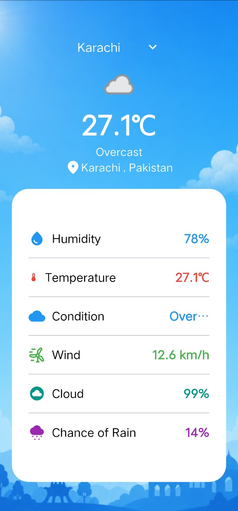

# Weather App 🌦️

A Flutter weather application that provides
current weather information using a REST API.

## Features

- Current weather
- Location-based weather
- Search cities
- Weather conditions
- Error handling

## Tech Stack

- Flutter
- Dart
- GetX
- REST API

## 📱 Screenshots

  
 

